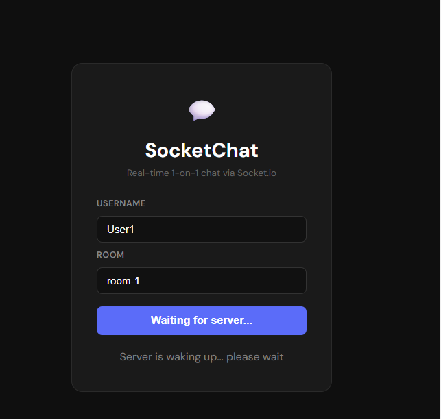
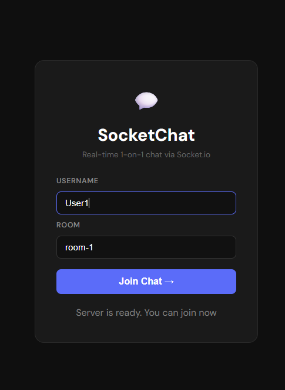
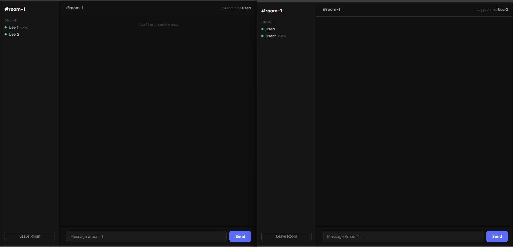
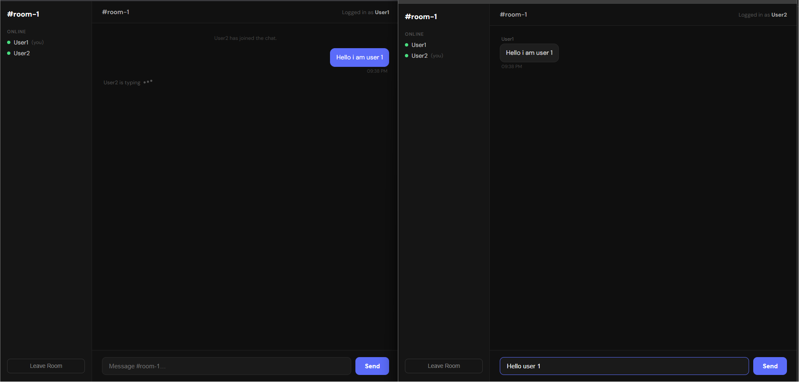

# 💬 SocketChat — Real-time 1-on-1 Chat App

A real-time chat application built using **Socket.io, Express, and React (Vite)**.

The project is fully deployed with:

* 🌐 Frontend: Vercel
* ⚙️ Backend: Render
* 🔁 Health-check system to handle server cold starts

🔗 **Live Demo:** https://chat-project-mocha.vercel.app/

---

## 📸 Screenshots

### 🟡 Waiting for another user



### 🟢 Ready to join chat



### 💬 Empty chat room



### 🔥 Active conversation



---

## 🚀 Features

* Real-time messaging using Socket.io
* Room-based chat system
* Typing indicators
* Live online users list per room
* Join and leave system messages
* Multiple chat rooms support
* Handles backend cold start delays (Render free tier)

---

## 🔥 Key Highlights

* Production deployment (Vercel frontend + Render backend)
* Server cold start handling using `/health` endpoint
* Client-side server readiness detection with polling
* Proper socket lifecycle management
* Prevents duplicate connections and race conditions
* Clean separation of frontend and backend

---

## 🛠️ Tech Stack

* Frontend: React (Vite)
* Backend: Node.js, Express
* WebSockets: Socket.io
* Deployment: Vercel + Render

---

## 📂 Project Structure

```
socketio-chat/
├── server/
│   ├── index.js          
│   └── package.json
│
├── client/
│   ├── index.html
│   ├── vite.config.js
│   ├── package.json
│   └── src/
│       ├── main.jsx
│       ├── App.jsx
│       ├── socket.js
│       ├── JoinScreen.jsx
│       ├── JoinScreen.module.css
│       ├── ChatRoom.jsx
│       └── ChatRoom.module.css
│
├── screenshots/
│   ├── join-waiting.png
│   ├── join-ready.png
│   ├── chat-empty.png
│   └── chat-active.png
│
└── README.md
```

---

## ⚙️ How to Use

You can either run locally or use the live demo.

### 🧪 Local Setup

1. Clone the repository:

```bash
git clone <repository-url>
```

2. Setup backend:

```bash
cd socketio-chat/server
npm install
npm start
```

3. Setup frontend:

```bash
cd ../client
npm install
npm run dev
```

4. Open browser:

```
http://localhost:5173
```

---

## 🌍 Live Version

👉 https://chat-project-mocha.vercel.app/

---

## 👤 Author

Ali Shaikh
